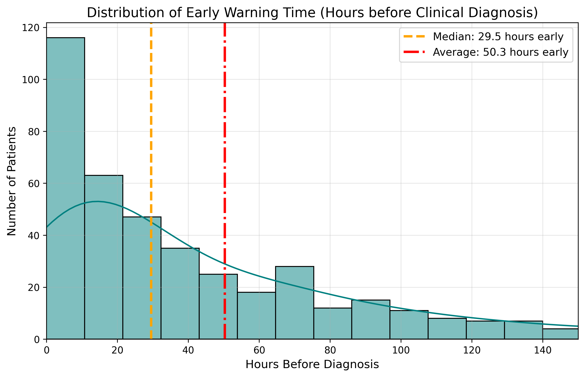
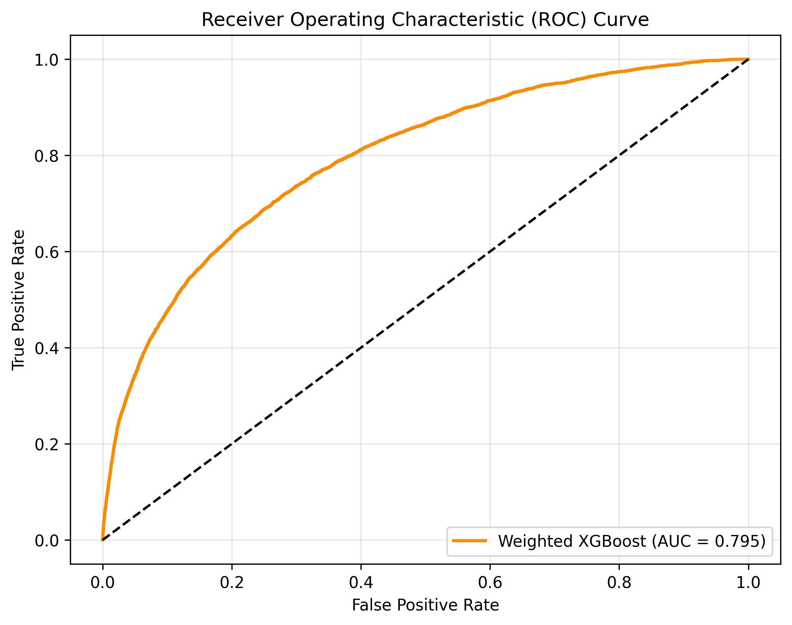
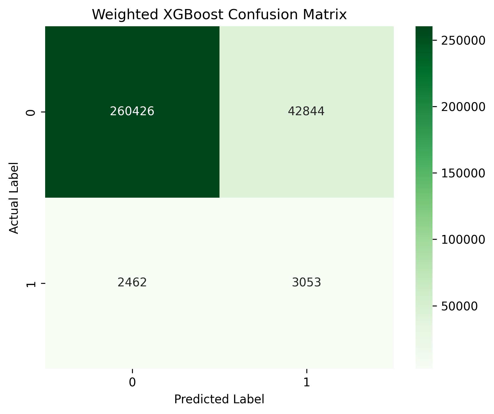
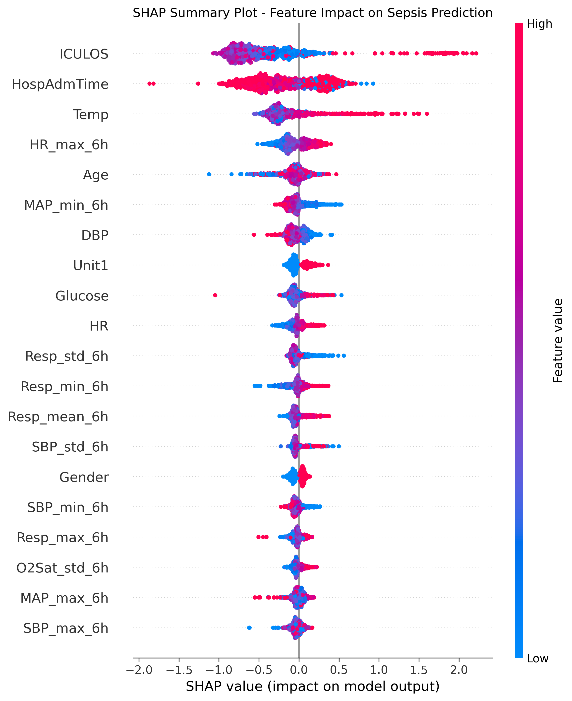

# Building a Real-Time Early Warning System for ICU Sepsis Prediction

This repository contains the code, models, and analysis for a Data Mining project aimed at predicting sepsis onset in ICU patients before clinical diagnosis. We utilized the PhysioNet 2019 Challenge dataset, containing over 40,000 ICU patients and millions of hourly records.

## Project Overview

Sepsis is one of the deadliest and most costly conditions in hospitals. Our goal was to build a system that alerts nurses and doctors to a deteriorating patient *before* clinical symptoms appear, providing a critical window for intervention.

### The Approach: Time-Series Feature Engineering & XGBoost
Instead of treating data as static snapshots, we adopted a time-series forecasting approach:
- **Rolling Windows:** We built rolling 6-hour windows for critical vital signs (Heart Rate, O2 Saturation, Systolic Blood Pressure, etc.).
- **Feature Engineering:** We calculated volatility (standard deviation over 6 hours) and extremes (min/max over 6 hours) to capture dynamic changes in patient physiology.
- **Modeling:** We trained a hyper-tuned XGBoost Classifier using `scale_pos_weight` to naturally handle the extreme class imbalance (98% non-sepsis, 2% sepsis) without relying on synthetic data techniques like SMOTE, which can break time-series integrity.

## Repository Structure

- `notebooks/`: Contains the main Jupyter Notebook (`Sepsis_Detection_Colab.ipynb`) with the full data pipeline and model training code.
- `models/`: Contains the trained models in `.pkl` format (Random Forest, XGBoost, and Advanced XGBoost).
- `figures/`: Contains visualizations of the model's performance and clinical impact.

## Key Results and Clinical Impact

The system produced strong predictive results and demonstrated significant clinical value:

- **AUROC (0.795):** The model effectively distinguishes between septic and non-septic patients.
- **Interpretability:** SHAP values showed the model heavily relied on our engineered features (e.g., `HR_max_6h` and `MAP_min_6h`), aligning with the clinical definition of Septic Shock (rising heart rate, falling blood pressure).

### Early Warning Metric

We ran a simulation on 577 unseen sepsis patients in the test set to measure when the model would trigger an alarm compared to the actual clinical diagnosis.

*(Figure: Distribution of Early Warning Times)*

- **Detection Rate:** The model caught **74.5%** of sepsis cases early or on time.
- **Median Early Warning Time:** **29.5 hours** before diagnosis.
- **Average Early Warning Time:** **50.3 hours** before diagnosis.

In a real ICU setting, this 29.5-hour head start gives doctors a massive window to intervene with fluids and antibiotics, potentially saving lives as each hour of delayed antibiotics increases sepsis mortality by 8%.

### Model Evaluation Visualizations

Here is a look at the model's performance metrics:

**ROC AUC Curves:**

**Confusion Matrices:**

**Feature Importance (SHAP):**

## Data

> [!NOTE]
> Due to file size limits, the large `.csv` datasets are not included in this repository. 

To run the notebook, you will need to download the PhysioNet 2019 Challenge dataset. The notebook expects the raw `.psv` files or the processed CSV files to be located in a `Dataset/` directory.

## Future Improvements

1. **External Validation:** Test the model on a separate dataset (e.g., eICU or AmsterdamUMCdb) to ensure generalizability.
2. **Deep Learning:** Implement LSTMs or Time-Series Transformers to process a patient's full ICU stay and find subtle, long-term patterns of decline.
3. **EHR Integration:** Build an API to connect this model directly into hospital Electronic Health Record (EHR) systems like Epic or Cerner for a live risk dashboard.
